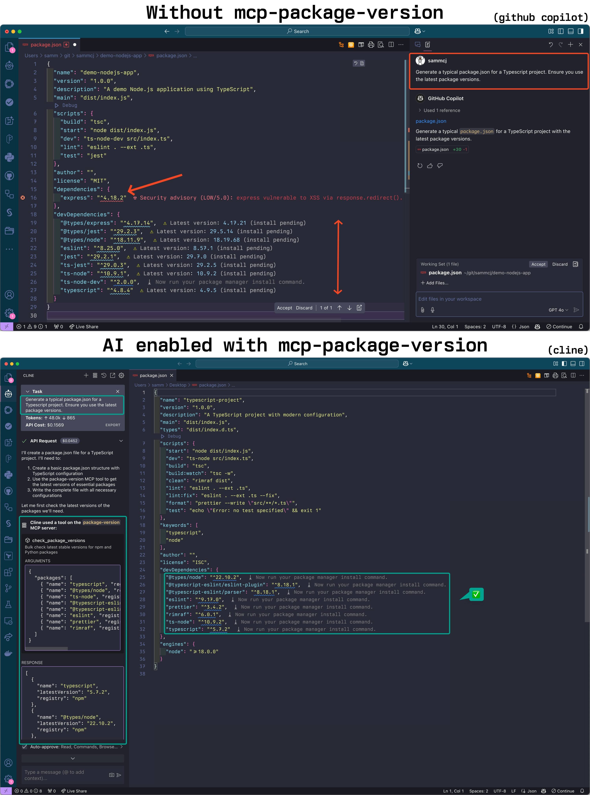

# Package Version MCP Server

An MCP server that provides tools for checking latest stable package versions from npm and PyPI registries. This server helps LLMs ensure they're recommending up-to-date package versions when writing code.

## Screenshot



## Running

**Configure MCP Settings**

Add the following to your MCP settings file:

```json
{
  "mcpServers": {
    "package-version": {
      "command": "npx",
      "args": ["-y", "mcp-package-version"]
    }
  }
}
```

- For the Cline VSCode Extension this will be `~/Library/Application Support/Code/User/globalStorage/saoudrizwan.claude-dev/settings/cline_mcp_settings.json`
- For Claude Desktop `~/Library/Application\ Support/Claude/claude_desktop_config.json`
- For GoMCP `~/.config/gomcp/config.yaml`


## Tools

### 1. check_npm_versions

Check latest stable versions for npm packages from a package.json dependencies object.

```typescript
use_mcp_tool({
  server_name: "package-version",
  tool_name: "check_npm_versions",
  arguments: {
    dependencies: {
      "express": "^4.17.1",
      "react": "^17.0.2"
    }
  }
});
```

### 2. check_python_versions

Check latest stable versions for Python packages from requirements.txt entries.

```typescript
use_mcp_tool({
  server_name: "package-version",
  tool_name: "check_python_versions",
  arguments: {
    requirements: [
      "requests==2.26.0",
      "pandas>=1.3.0"
    ]
  }
});
```

### 3. check_package_versions

Bulk check latest stable versions for multiple packages from npm and PyPI.

```typescript
use_mcp_tool({
  server_name: "package-version",
  tool_name: "check_package_versions",
  arguments: {
    packages: [
      { name: "react", registry: "npm" },
      { name: "requests", registry: "pypi" },
      { name: "typescript", registry: "npm", currentVersion: "5.0.0" }
    ]
  }
});
```

## Guidelines for LLMs

When writing code that includes package dependencies, LLMs should:

1. **Always Check Versions Before Writing**
   - Before writing a package.json or requirements.txt file, use the appropriate tool to check latest versions
   - Use the bulk check tool when dealing with multiple packages
   - Consider the project's needs when deciding whether to use exact versions or version ranges

2. **Package.json Best Practices**
   ```typescript
   // Before writing package.json, check versions
   const versions = await use_mcp_tool({
     server_name: "package-version",
     tool_name: "check_package_versions",
     arguments: {
       packages: [
         { name: "express", registry: "npm" },
         { name: "react", registry: "npm" }
       ]
     }
   });

   // Use the returned versions in package.json
   {
     "dependencies": {
       "express": "^{express.latestVersion}",
       "react": "^{react.latestVersion}"
     }
   }
   ```

3. **Requirements.txt Best Practices**
   ```typescript
   // Before writing requirements.txt, check versions
   const versions = await use_mcp_tool({
     server_name: "package-version",
     tool_name: "check_package_versions",
     arguments: {
       packages: [
         { name: "requests", registry: "pypi" },
         { name: "pandas", registry: "pypi" }
       ]
     }
   });

   // Use the returned versions in requirements.txt
   requests=={requests.latestVersion}
   pandas=={pandas.latestVersion}
   ```

4. **Version Range Considerations**
   - For applications: Consider using exact versions (= for Python, no prefix for npm)
   - For libraries: Consider using compatible ranges (>= for Python, ^ for npm)
   - Always document version choices in comments

5. **Error Handling**
   - If version check fails for a package, document it in comments
   - Consider falling back to known stable versions if checks fail
   - Warn users about any packages that couldn't be verified

## Example Integration

Here's how an LLM should approach creating a new Node.js project:

```typescript
// 1. First check all needed package versions
const versions = await use_mcp_tool({
  server_name: "package-version",
  tool_name: "check_package_versions",
  arguments: {
    packages: [
      { name: "express", registry: "npm" },
      { name: "typescript", registry: "npm" },
      { name: "ts-node", registry: "npm" }
    ]
  }
});

// 2. Use the versions when writing package.json
write_to_file({
  path: "package.json",
  content: {
    "name": "my-project",
    "version": "1.0.0",
    "dependencies": {
      "express": `^${versions.find(p => p.name === 'express').latestVersion}`,
      "typescript": `^${versions.find(p => p.name === 'typescript').latestVersion}`,
      "ts-node": `^${versions.find(p => p.name === 'ts-node').latestVersion}`
    }
  }
});
```

This ensures that new projects always start with the latest stable versions of packages.

---

## Example System Prompt

```plaintext
When writing code that includes package dependencies, you must:

1. Before writing any package.json or requirements.txt file, check latest stable versions using the package-version MCP server:

// For multiple packages (preferred method):
use_mcp_tool({
  server_name: "package-version",
  tool_name: "check_package_versions",
  arguments: {
    packages: [
      { name: "package-name", registry: "npm" },  // for npm packages
      { name: "package-name", registry: "pypi" }  // for python packages
    ]
  }
});

// For package.json only:
use_mcp_tool({
  server_name: "package-version",
  tool_name: "check_npm_versions",
  arguments: {
    dependencies: {
      "package-name": "version"
    }
  }
});

// For requirements.txt only:
use_mcp_tool({
  server_name: "package-version",
  tool_name: "check_python_versions",
  arguments: {
    requirements: [
      "package-name==version"
    ]
  }
});

2. Use the returned latest versions in your dependency files:
   - For applications: Use exact versions
   - For libraries: Use compatible ranges (^ for npm, >= for Python)
   - Document any version-specific requirements in comments

3. If version checks fail, note it in comments and use known stable versions
```

Example system prompt for users:

```plaintext
When writing code that includes dependencies, you must check latest stable versions using the package-version MCP server before writing package.json or requirements.txt files. Use exact versions for applications and compatible ranges for libraries. Document any version-specific requirements or failed checks in comments.
```

## Building and Running

1. **Clone and Install Dependencies**
   ```bash
   git clone https://github.com/sammcj/mcp-package-version.git
   cd mcp-package-version
   npm i
   ```

2. **Build the Server**
   ```bash
   npm run build
   ```

3. **Development**
   - Use `npm run watch` for development to automatically rebuild on changes
   - Use `npm run build` for production builds

No environment variables are required as this server uses public npm and PyPI registries.

## License

[MIT](LICENSE)
